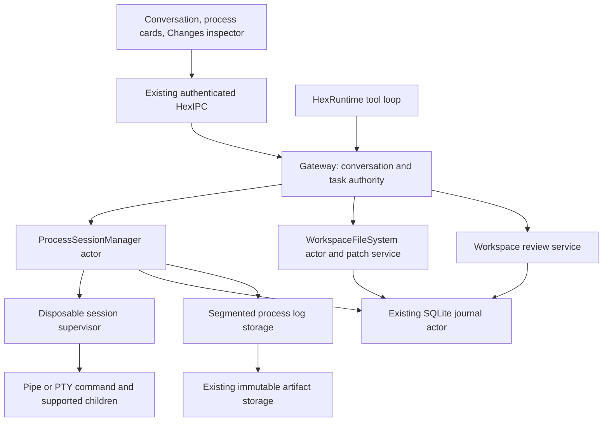

# Persistent coding workflows for Hex

Status: design record, September 9, 2026. The feature is now implemented on its isolated branch. See the [implementation contract and verification](coding-workflows-implementation-2026-09-09.md) for delivered behavior, changed limits and remaining activation gates; that document takes precedence over this proposal.
Ticket: `435E5083-72FD-4F2C-B32F-F8A8F8DB6862`, **Finish real coding workflows with persistent terminals and reviewable changes**.
Verified base: local `dev`, `94e3b20b0fb898eaefc5527bbee282def7e892c2`.
Research and pinned primary sources: [coding harness research](coding-harness-research-2026-09-09.md).

## 1. Decision and user outcome

Build a Hex-owned process-session service alongside the existing one-shot process tool, a guarded patch operation on the existing workspace writer, and a review snapshot service. Connect these to the existing Conversations workspace, durable task queue, authorization broker and SQLite journal. OpenAI and MLX continue to supply inference only.

The first complete journey is: inspect an existing project, preserve its dirty work, make a small change, run a build, diagnose a known failure, correct it, keep a preview server or REPL alive, close/reopen Hex, inspect the same session, and review the actual changes and verification evidence.

Sessions persist across tool returns, model turns, pause/resume and UI closure while the resident lives. V1 does **not** restore an executing process after resident loss. It stops supported child processes, preserves evidence, marks interruption honestly and never automatically repeats a start or stdin write with an uncertain outcome. A future supervisor that survives resident replacement would be a separate extension of this contract.

Build a useful process interface inside the current conversation. A full terminal emulator, debugger, LSP, agent delegation, automatic commits, dependency installation, arbitrary daemon hosting and release packaging are outside this ticket.

## 2. Current Hex foundations and gaps

These are current-source findings at the base above, not the older September 5 status page.

| Foundation | Verified behavior | Required extension |
| --- | --- | --- |
| `ProcessRunTool` | Absolute executable/argv; host cwd; identity-bound authorization revalidated before spawn | Explicit long-lived sessions and later input/output/control |
| `POSIXProcessExecutor` | Null stdin, combined output pipe, owned process group, bounded lifetime; cleanup on completion | PTY/pipe adapters whose lifetime does not equal one tool invocation |
| `HexGatewayService` | Resident task queue, linked attempts and pause/steering; one active driver | Background sessions must release the driver slot after admission |
| `WorkspaceFileSystem` | Actor-owned root descriptors, expected revisions, exact replacement counts and guarded atomic file publication | Structured patch preflight and durable per-file apply records |
| `FileArtifactStore` | Immutable artifacts; published references only after finish; existing storage quotas | Live log tail plus sealed segments behind one paginated log identity |
| `SQLiteAgentEventJournal` | Sole database actor; conversation/task/run relationships and effect index | Session metadata, operations, output indexes and change evidence |
| Unified Conversations | Stable parent and contextual follow-ups | Inline process cards and a Changes inspector using the same conversation |

Key source entry points:

- `Packages/HexKit/Sources/HexCapabilities/Process/ProcessRunTool.swift:68` and `POSIXProcessExecutor+Spawn.swift:69`.
- `Packages/HexKit/Sources/HexCapabilities/Process/POSIXProcessExecutor+Monitor.swift:126`.
- `Packages/HexKit/Sources/HexCapabilities/Workspace/WorkspaceFileSystem+Write.swift:230`.
- `Packages/HexKit/Sources/HexGatewayKit/Resident/HexGatewayResidentHost.swift:45` and `:393`.
- `Packages/HexKit/Sources/HexIPC/Service/HexGatewayService+TaskScheduler.swift:72`.
- `Packages/HexKit/Sources/HexPersistence/Artifacts/FileArtifactStore.swift:6`.

Two recovery changes are prerequisites. First, `GatewayTaskCheckpoint.hasUncertainEffects` currently treats a dispatched failure as uncertain, while `ProcessToolResult` reports a known nonzero exit as failure. A compiler error must remain a known result. Second, the task guard fingerprints tool name and arguments across attempts. Identical post-fix builds can collide with a prior command. Do not solve either problem by globally declaring process execution read-only or adding arbitrary nonces to evade replay protection.

## 3. Ownership and module boundaries

`HexCore` defines small Sendable contracts: `ProcessSessionID`, `ProcessSessionScope`, `ProcessSessionSnapshot`, `ProcessOutputCursor`, `ProcessOperationReceipt`, `ProcessSessionReading`, `ProcessSessionControlling`, `ProcessSessionStorage`, `WorkspaceChangeReceipt` and `WorkspaceReviewSnapshot`. Persisted values are Codable. One named production type per Swift file remains mandatory.

`HexCapabilities` implements `ProcessSessionManager` as the single actor owning live handle state, serialized controls, admission reservations and I/O ownership. Platform adapters own their descriptors and child wait handles; blocking Darwin operations run on a dedicated owned I/O boundary, never on the cooperative actor executor. The patch implementation extends the existing workspace transaction machinery. Git observations use a separate narrow read service.

`HexPersistence` implements the new storage protocols through the existing journal actor and artifact store. It does not open a competing SQLite connection. `HexGatewayKit` constructs and injects one manager and resolves scope. `HexIPC` carries bounded projections and controls. `HexRuntime` uses Core contracts without importing concrete process or storage modules. UI models subscribe and paginate; they cannot launch children or own process lifetimes.

The resident must resolve run → task → conversation → workspace from its own records. Extend `ToolExecutionContext` with a host-created scope, or inject an equivalent resolver. Never accept a model's claim of conversation ownership. A known session UUID is a lookup key, not authority. Follow-ups in the same conversation may inherit access through the recorded relationship; other conversations cannot control the session implicitly.

## 4. Native process supervision

### Recommended lifecycle boundary

Use a small disposable supervisor per live session, launched through an early internal mode of the existing embedded `HexGateway` executable. That mode must execute before resident setup, provider loading, Keychain access or LaunchAgent behavior. It receives bounded startup configuration and private inherited descriptors. It exposes no TCP listener, independent service registration or public command API.

The supervisor owns the PTY/pipes and supported command tree. The resident owns policy, durable records and the control lease. Put the supervisor in a process group separate from the resident so launchd's resident-group cleanup cannot kill it before it handles control-channel EOF. The target command has a distinct managed group/session appropriate to its mode. No target inherits the private control endpoint; enforce close-on-exec and explicit descriptor inheritance.

On orderly stop or resident control-channel loss, the supervisor stops accepting input, requests termination, drains bounded output and escalates after a grace period. While the resident is alive, it journals the supervisor's observed result. After resident death there is no surviving SQLite writer or V1 sidecar receipt: startup therefore retains `cleanupUnconfirmed` and unknown tail completeness even if cleanup probably succeeded. Fresh observation/reconciliation is required to establish more; the supervisor does not reconnect to a new resident or restart the command.

Use an independent bounded control channel and nonblocking output channel, or an equivalently fair framed multiplexer. Output flood or a slow artifact/SQLite sink must not starve control, EOF or deadline checks. Renew the control lease every 2 seconds; expire after 15 seconds of awake time. Sleep itself does not consume that lease. After wake, require the original same-epoch channel to renew within 5 awake seconds, bounded by its remaining lease; EOF always initiates stop immediately. Expired leases never revive. The separate command runtime deadline counts elapsed time including sleep and is checked on wake. Verify clock and wake detection in Slice A.

This extra process is justified by a specific failure: killing the resident must not leave an unowned build/server solely because Swift cleanup code never ran. It is not an additional agent or runtime. A same-binary mode still changes a sensitive startup path and needs independent review.

### PTY scope and feasibility gate

Pipe mode is the default for builds, tests, scripts and servers. Keep stdout and stderr separately tagged. PTY mode is explicit for direct interactive executables such as a Python REPL; it has one combined terminal stream. Never silently downgrade a requested PTY to pipes.

V1 does not offer an interactive job-control shell or claim full-screen terminal emulation. Shell commands can run through explicit noninteractive shell argv; a direct REPL can accept interactive input. Interactive shells move jobs into additional groups, so `kill(-shellPID)` alone is insufficient even without daemonization. Unsupported detached/daemonized children must be documented, and detected cleanup uncertainty must remain visible. Do not kill a newly discovered process merely because its numeric PID resembles a saved one.

The first implementation slice must prove the spawn adapter on supported macOS: controlling terminal, foreground group, input, interrupt, resize, leader exit before child, escaped group, supervisor crash and resident SIGKILL. Prefer a vetted `posix_spawn`/terminal-setup boundary. Do not run Swift/Foundation after `fork()` from the multithreaded resident. If a tiny C launcher is necessary, its package target and packaging changes require the repository steward's ownership during implementation. The research establishes relevant APIs, not a finished safe launcher.

A supervisor also can crash. Resident detection should attempt cleanup only with still-valid owned identities, then show `cleanupUnconfirmed` if it cannot verify extinction. Simultaneous supervisor/resident death and arbitrary daemon escape are not solved by a process-group promise. Do not mark this gate passed until the supported lifecycle has actual packaged-app evidence.

## 5. Sessions, operations and lifecycle

Persist a session with `sessionID`, `conversationID`, creator task/run, host workspace identity, resident epoch, supervisor identity, executable/argv digest, environment-profile digest, transport, lifetime policy, timestamps/deadline, phase, state revision, input sequence, output log ID/cursors, exit evidence and cleanup state. PIDs are diagnostic metadata, never reconnect credentials. Do not persist environment values or provider credentials in the row.

Use phases `preparing`, `running`, `stopping`, `exited`, `interrupted` and `blocked`. Track exit code/signal separately from cleanup (`pending`, `confirmed`, `unconfirmed`) and capture (`complete`, `truncated`, `failed`). A quiet process is still running; output resembling a prompt is only a UI hint.

| Event | Process behavior | Task behavior |
| --- | --- | --- |
| Start wait expires | Return the same session ID; process continues | Driver can perform other tools |
| UI closes/disconnects | No lifetime change | Resident continues admitted work |
| Agent pause or steering | Existing process continues; no additional agent input dispatched | Stop/continue decisions at existing durable boundaries |
| Stop waiting for output | Cancel only that read subscription | No process signal |
| Interrupt process | Signal the validated foreground execution group | Keep session observable; wait for actual result |
| Stop process | Terminate supported tree, then bounded escalation | Show stopping until receipt and cleanup evidence |
| Task completes | Stop request-scoped sessions; retain explicitly conversation-scoped servers | Publish completion only after required disposition receipts; unconfirmed cleanup blocks completion |
| Task cancels | Stop sessions created by that task, including retained candidates; revoke its pending inputs | Drain stop receipts without replay; older conversation sessions remain unless explicitly targeted |
| Resident shuts down/restarts | Stop all sessions before storage closes | Persist exit/interruption; no automatic process recreation |
| Resident crashes | Supervisor EOF/lease expiry attempts cleanup; no V1 durable post-crash acknowledgment | New resident fences old sessions, preserves cleanupUnconfirmed and blocks affected uncertain work |
| Deadline/quota reached | Stop with explicit cause | Preserve available evidence and explain failure |

Lifetime is `request` by default. A request to keep a dev server available can authorize `conversation` lifetime; record that decision and a finite deadline. Such sessions are listed independently of whether a model turn is active. Pausing Hex pauses the agent's decisions, not a process already executing code. The UI must say when processes continue.

Request lifetime binds the stable task ID across all its attempts. Entering final disposition fences pending agent and human writes for request-scoped sessions; accepted writes finish recording before stop proceeds. A final answer may be drafted first, but ordinary completed state waits for that disposition. Retained conversation-scoped sessions transfer away from task cleanup only through the recorded retention decision. Cancellation shows cancelling while stop settles, and blocked with attention if cleanup remains unconfirmed.

Pending approvals and reserved operations belong to their originating task generation. A late approval after cancel or a changed revision must not launch a process or send input. Serialize state changes before awaits, reserve slots before storage work, and revalidate epoch/revision after asynchronous returns.

## 6. Tool and IPC contracts

Use separate observation and mutation tools with strict schemas. These are proposed names, not existing APIs.

| Tool | Important inputs | Receipt |
| --- | --- | --- |
| `process_start` | Explicit executable/argv; optional relative cwd under approved workspace; `pipe`/`pty`; lifetime; run deadline; initial wait | Session ID, phase/revision, accepted operation, output page and cursor |
| `process_list` | Resident-derived conversation scope; cursor/limit | Bounded current/historical session summaries |
| `process_read` | Session ID; absolute byte cursor; max bytes; wait ≤ 30 s | Bytes/preview, next cursor, durable-through cursor, current state and gaps |
| `process_write` | Session ID; expected input sequence; UTF-8 text; bounded wait | Exact accepted byte count, sequence and operation state; then output observation |
| `process_control` | Session ID; expected state revision; `interrupt`, `eof`, `stop` or `resize`; size where relevant | Requested versus confirmed control outcome and updated state |
| `workspace_git_status` | Approved workspace, paging | Repository identity, HEAD/index fingerprint, staged/unstaged/untracked summaries |
| `workspace_git_diff` | Snapshot ID and explicit comparison scope/path; paging | Immutable diff artifact, base/current identities and completeness |
| `workspace_apply_patch` | Bounded unified diff and exact expected preimages for every affected path | Apply-operation ID and per-file before/after receipts |

An execution operation ID is issued by the host at tool admission and reused across transport retries. The model cannot supply random IDs to bypass safety. UI controls issue an operation ID once and retain it until a definite response. Requests bind their exact arguments to the ID; reuse with changed arguments conflicts. Native IPC mirrors the same service, so manual input and agent input pass through one ordered control path.

Coding builds and tests use `process_start` even when finite and quick, with request lifetime and a short initial wait. This gives them the same receipt/recovery policy as interactive work. Retain `process_run` for existing bounded one-shot callers and incidental commands; do not silently change its timeout/output or legacy fingerprint behavior. Shared lower-level spawn/capture code can be extracted after lifecycle tests protect its contract.

Pipe EOF closes stdin. PTY EOF is a terminal input request based on the configured line discipline, not proof the underlying descriptor closed; report it accordingly. Interrupt is separate from arbitrary text and from stop. Resize changes terminal dimensions and may signal the process; it is not classified as a read.

## 7. Permissions and effect certainty

Preserve Hex's executable/cwd identity check and exact authorization snapshot. Launch permission binds scope, executable and relevant script identities, argv, environment profile, transport, lifetime and deadline. Resolve tools through a host-selected environment profile; do not implicitly source user shell startup files. No raw shell text interpolation by Hex; a model-chosen shell command is an explicit argv element reviewed as execution.

Every stdin write is a mutating capability. In Ask mode it needs authority for that input or a previously approved interactive-session scope that actually covers it. Approve for Me uses host classification; Full Access retains identity and ownership checks. Session creation alone does not grant unlimited future stdin. Revoking a future-input grant fences new writes; revoking the active execution/lifetime grant also initiates stop. A general permission-mode change follows the existing authorization semantics for already dispatched work and rechecks future actions. Human input uses the same ordering and updates the agent's input cursor.

Do not persist secret input or encourage password entry through provider-visible terminal tools. Secret-required prompts route to the existing human/secure boundary. Ordinary process logs can still contain sensitive application output: keep them local, export only on user action, and present provider-visible output as untrusted data. Terminal controls cannot execute clipboard, hyperlink, file-open or shell actions in the UI.

A working directory and an approval are not an OS sandbox. This ticket preserves the existing approved host-execution model and does not claim filesystem/network confinement for arbitrary subprocesses. Typed file tools keep their path boundaries; a permitted script can have wider OS effects. Do not add a silent privilege expansion or call ordinary Git/build programs harmless solely by name.

### Typed evidence, not a success Boolean

Introduce host-owned operation evidence distinguishing `notDispatched`, `accepted`, `completed` and `unknown`. Keep semantic success (for example exit 0 versus exit 1), capture completeness and cleanup certainty independent. A start receipt proves admission/spawn, not command completion. A full stdin write proves bytes delivered, not successful execution of the code they contain.

Expose this only through trusted native adapters and durable receipts. A provider/MCP tool cannot self-declare safe completion. Decode old records conservatively and preserve current unknown behavior when evidence is absent. This must update both checkpoint recovery and the independent effect index, not just change UI copy.

For new session mutations, persist the host operation and intent before dispatch. Exactly the same operation returns its saved receipt, or current pending/unknown state; it never writes twice. Stdin accepts one ordered operation at a time. If a partial write or crash makes delivery uncertain, fence the whole session for further input and require observation/reconciliation. Never send the remaining bytes automatically after reconnect.

Keep the legacy fingerprint guard for existing tools. Add a narrow host-verified policy for session operations: read/list are observations; writes bind session epoch and host sequence. Across recovered attempts, an already accepted start/input is referenced through its saved session/receipt rather than reissued.

For repetition, define a lineage by stable task, workspace and canonical executable/argv/environment/transport intent. Never infer a fresh lineage from a different provider call ID. A new generation of a previously executed coding validation command requires its known terminal result, changed qualifying host-captured workspace content evidence since that invocation, and an authorization record permitting that repeated validation. Merely rereading unchanged Git status is insufficient; a model-supplied purpose label cannot classify an arbitrary script as repeatable validation. Where the broker cannot establish that authority, require explicit user-directed repetition through normal authorization. An unresolved earlier generation blocks its replacement regardless of call ID. Intentionally independent simultaneous identical invocations need a separate user-authorized purpose/lineage; a duplicate request is otherwise directed to the existing session. This restriction does not serialize unrelated commands or workspaces.

This is transport idempotency and controlled continuation. It does not establish exactly-once business effects for arbitrary shell code or recognize every semantically equivalent command. Preserve that boundary in tests and product claims.

## 8. Output storage and pressure

Keep raw output as ordered byte frames with stream tag and timestamp. PTY uses one terminal stream; pipes use stdout/stderr tagged frames without inventing a total causal ordering between OS streams. Offsets describe the captured ordering. Handle partial UTF-8 and newline-free prompts incrementally. Produce sanitized bounded text for the model and UI; preserve raw evidence locally.

Use a stable `ProcessLogID` with an actor-owned live tail and sealed immutable artifact segments. Seal at a byte threshold or bounded low-volume interval, then commit the segment index through the journal actor. Never emit empty segments. A read takes one coherent log-generation snapshot spanning sealed segments and the tail; publication cannot duplicate or skip bytes at the boundary. UI/model readers have independent non-consuming cursors; canceling a read or losing its response does not lose output. A UI notification only says more output is available. It cannot be the source of truth.

Before journaling a tool result that exposes tail bytes, flush that bounded range and index so the result's consumer cursor cannot outrun durable source evidence. Persist the consumer cursor with the result. Resume from that cursor after attempt recovery. UI-only tail previews report both captured and durable-through offsets. After crash, represent `unknownTailAfter(durableOffset)` if unpublished extent is unknown; never invent an end cursor or missing-byte count. Already published segments remain hash-verifiable. Publication-before-index failures are discoverable owned orphan artifacts, not guessed transcript content.

Do not add every segment to the current 256-artifact conversation inventory. Authorize one log handle; host-owned paginated log reads resolve segment references internally. A selected export or diff may become a normal artifact. Completed manifests use paging, not an unbounded array in one tool result.

Proposed initial configuration, subject to the qualification workload:

| Limit | Default / rule |
| --- | --- |
| Live sessions | 4 resident-wide, 2 per conversation; explicit capacity failure, no live eviction |
| Inline output | 16 KiB by default; maximum 64 KiB per response |
| Reader wait | 0–30 seconds; return on output/state change; wait timeout never kills command |
| Input | 16 KiB per operation; serialized and bounded queued bytes |
| Log segment | 256 KiB or 30 seconds of nonempty low-volume output; also seal before a journaled tool result |
| Segment/metadata bounds | 2,048 segments/session, 8,192 aggregate; 8 MiB metadata/session and 32 MiB aggregate; actual disk allocation counts against storage quota |
| RAM capture queue | At most 1 MiB per session; continuous draining must yield to controls |
| Retained session logs | 64 MiB/session and 512 MiB aggregate, also subject to existing 2 GiB artifact quota |
| Runtime deadline | 30 minutes request-scoped; 8 hours conversation-scoped; explicit bounded extension |
| Stop escalation | TERM grace of 3 seconds, then KILL; bounded final drain and explicit unconfirmed cleanup |
| UI updates | At most 10 per second; reading position preserved unless Follow output is enabled |

Reserve storage/accounting capacity before spawn, including terminal status metadata. At capture or disk failure, stop the process with a truthful reason and retain the known prefix; never block indefinitely on an output pipe or silently drop bytes. Increasing a limit cannot evict historical evidence behind existing references. Cleanup of retained logs is explicit and reference-aware; reaching quota asks for cleanup or extension before admitting more work.

## 9. Patch application and change evidence

Use the existing descriptor-pinned `WorkspaceFileSystem`; do not replace it with shell `sed`, blind writes or a `git apply` subprocess. V1 supports UTF-8 file create, update and explicit delete. Binary patches, symlink changes, hardlinked files, mode-only changes, submodule contents and implicit renames are rejected with a precise unsupported result. A rename can be planned later with an explicit two-path recovery contract; do not silently lower it into destructive operations.

Before any mutation, parse the complete bounded unified diff; verify all paths, operation counts and preimages; require every hunk to match exactly and unambiguously; build candidate contents; and capture recoverable before/after references. No fuzzy whitespace matching. Expected preimages use the workspace's content revision, or an explicit absent condition for creation. Require at most 32 files, 2 MiB patch input and 8 MiB total candidate text for the initial implementation. Larger work is split deliberately with visible receipts.

Persist an apply plan before publishing. Serialize all Hex writes for the affected workspace. Revalidate each preimage immediately before publication, use existing guarded per-file atomic swaps, and persist actual per-file progress. Successful file results include old/new revisions and immutable evidence. Failed whole-plan preflight means zero files changed. A later I/O or per-file revalidation failure can leave earlier whole-file changes applied; return `partial` with exact applied/unchanged/unknown paths. Do not claim cross-file atomicity. Explicit delete needs a descriptor-validated retained preimage/tombstone operation in the same transaction machinery; do not implement it as an unchecked unlink.

On crash recovery, compare each file against the plan's recorded before/after values. A matching after-image can establish publication; a matching before-image establishes current preimage, not necessarily that no transient write ever happened. Anything else is conflicted/unknown. Recovery never blindly rolls back over a user's later edit. Any requested rollback must pass current revision checks. The plan and before-images are retained until safely resolved.

This is not a kernel compare-and-swap against arbitrary external editors. Existing guarded publication narrows the race and preserves evidence, but a same-UID external writer can race between observations. Prefer a Hex-owned isolated checkout where practical, preserve displaced content using the current transaction design, and report detected conflicts. No blanket no-clobber claim for an uncontrolled shared directory.

Old write/replace tools must also emit change receipts when used in a coding task. Shell/formatter/build changes cannot be attributed through those receipts and are captured by review snapshots instead.

## 10. Workspace and Git review

Bind a coding request to a host-approved workspace identity before admission. Record root device/inode, canonical Git worktree and common-directory identities, branch or detached HEAD, HEAD commit, index fingerprint and staged/unstaged/untracked state. A host-selected child worktree is a distinct workspace binding, not a model-supplied escape from the resident's current root.

V1 can operate in an existing approved checkout. Respect repository instructions requiring worktrees; require an approved isolated checkout to exist in that case. Do not silently create a worktree from HEAD that omits the user's dirty work. Automated worktree creation/import is a separate explicit capability if needed later. Multiple conversations writing the same workspace require a resident workspace ownership lease; conflicting writes wait or return busy, while authorized observations can proceed. A conversation-scoped dev server keeps that lease associated with its conversation. External editors remain outside this lock.

Capture a baseline before mutations: staged and unstaged diffs, index identity, untracked path metadata, and bounded content/preimage evidence needed for touched text. Do not copy ignored/secret/binary contents wholesale or claim a complete snapshot of an arbitrarily large repository. Paginate file lists and mark excluded/unavailable content. A changed or missing root fails closed; a non-Git workspace still supports file receipts and before/after review.

Read Git with explicit argv, disabled optional locks, external diff, textconv, fsmonitor and pager. Clear inherited Git overrides that can redirect the repository or execute helpers. Use NUL-delimited paths, protect revision/path boundaries and never interpolate output into a shell command. Status, log and diff adapters run no checkout, hooks, fetch, filters, commits or pushes. Detect HEAD/index movement during capture and retry a bounded time or mark the snapshot inconsistent. Unborn HEAD, detached HEAD, untracked/binary paths and submodule entries have explicit result variants rather than being parsed as errors or empty diffs. [Git status](https://git-scm.com/docs/git-status), [Git diff](https://git-scm.com/docs/git-diff)

The Changes inspector offers three clear views:

1. **Existing changes**: the staged/unstaged/untracked state at task start.
2. **Changes during this work**: observed baseline-to-current differences, annotated with confirmed typed-edit receipts where available. Other edits are labeled observed, not attributed to Hex.
3. **Repository changes**: explicit staged, unstaged, untracked or selected-base comparison, including binary/unavailable summaries.

Never use final `git diff HEAD` as the whole review: it mixes pre-existing edits and misses untracked content. Do not offer a generic Revert all in this ticket. Git mutation, staging, commit, push, reset, clean and checkout deletion retain their own explicit user authority.

Produce an immutable final review snapshot with file list/diffs, completeness markers, baseline/current identities and command receipts. Build evidence records command, cwd, environment-profile identity, start/end, exit status and output reference. Capture workspace state around validation; if files move during/after a build, label the result stale or concurrent instead of claiming it tested the final diff. Passing tests alone never establish deployment or distribution readiness.

## 11. Conversation experience

Keep the current minimal pink interface and one composer. A process tool row expands into a card with command, project path, running/stopping/exit state, recent output, View output, Interrupt and Stop. Pending approval uses the existing inbox. The output inspector has a Follow output toggle, paging, optional text input and PTY size controls; no second Tasks workspace.

A conversation can show “Preview server is still running” after the answer. “Pause Hex” explains that existing processes continue. “Stop process” targets exactly the chosen session. A closed or archived conversation cannot hide live owned processes; stop them or present the explicit retention decision before archive. Global settings can list all live sessions and invoke the same controls.

The Changes inspector shows the views above with keyboard navigation, selectable text, VoiceOver labels, Dynamic Type support and reduced-motion behavior. Treat ANSI/OSC/control bytes as data: render a small safe subset or escaped plain text, never terminal-driven clipboard/URL execution. Unsupported full-screen programs show a clear limitation instead of a misleading screen reconstruction.

## 12. Storage, IPC and migration

Allocate the next schema version after checking implementation-time `dev`; do not hardcode a version based on this proposal. Add session rows, operation receipts, output-segment indexes, patch plans/file receipts and review snapshots through `SQLiteAgentEventJournal`. Foreign keys connect existing conversations/tasks/attempts. Do not copy or rewrite original transcripts or historical effects.

Create session/operation intent durably before dispatch; update session state and receipt atomically where they share the database. OS effects and SQLite transactions are separate, so the spawn/write-before-receipt window must lead to pending/unknown recovery, never presumed nonexecution. Extend IPC and capability negotiation so an older helper explicitly rejects unsupported session control. Audit every live-client forwarding method; previous Hex work showed protocol defaults can hide missing forwarding.

Startup reconciliation completes before process admission or recovery of linked task effects. Old-epoch sessions become interrupted and their mutations remain fenced. Graceful shutdown order is: close admission, cancel pending grants, stop session input, stop/drain supported processes, persist terminal evidence, drain task drivers and output publication, then close storage. Put a bound on shutdown and retain any unconfirmed result instead of hanging forever.

## 13. Build sequence and acceptance

These are implementation slices of one ticket, not separate claims that the user workflow is complete.

| Slice | Work | Exit evidence |
| --- | --- | --- |
| A. Platform and effect contract | PTY/supervisor feasibility; known-failure versus uncertainty; operation identity and cleanup model | Direct REPL/server, kill races and duplicate-input fixtures prove the chosen macOS boundary |
| B. Session backend | Actor, startup/control/read tools, scoped permission checks, bounded log storage | Sessions yield, input works, independent reads agree, quotas and ownership fail safely |
| C. Durable integration | SQLite indexes, linked task effects, cursor checkpoints, IPC, startup/shutdown | Pause/steering and UI reconnect preserve the same live session; resident loss never replays |
| D. Editing and review | Patch plan and receipts, Git baseline/current capture, change provenance | Dirty/staged/untracked work preserved; conflict and partial application represented correctly |
| E. User journey | Existing conversation cards, output/Changes inspectors, final build evidence | Actual signed app completes the real coding journey and failure cases below |

Required behavior checks:

- Start a local preview server, receive its handle, perform another tool call, close/reopen UI, query the same process, then stop and prove the port is released.
- Use a direct PTY REPL with a newline-free prompt, two identical deliberate inputs, resize, interrupt and EOF. Retrying either input operation must deliver it once.
- Lose the response after start acceptance. Read/retry identifies one session; it does not spawn a second server.
- Kill the resident after input dispatch but before durable acknowledgment. The old session is fenced, supported children stop, and resume cannot repeat the input automatically.
- Distinguish known exit 1, timeout with known cleanup, output failure, partial stdin and unknown cleanup. A failing test followed by an edit and a new build must work across pause/resume.
- Exercise process exit before descendant exit, inherited pipe handles, supervisor crash, wrong/stale ID, cross-conversation control, revoked approval and late callbacks. Never signal an unrelated process.
- Flood output, split UTF-8, omit newlines, emit hostile terminal controls, disconnect readers and exhaust quotas. RAM and storage remain bounded; missing output is explicit.
- Race a read with segment sealing and consumer checkpoint commit; prove no missing/duplicate bytes. Keep low-volume output running long enough to exercise segment-count limits and simulate sleep/wake lease renewal.
- Pause and steer while a server runs; cancel its originating request; retain an older conversation-owned server correctly. Shutdown has a finite, truthful result.
- Apply patches with stale revisions, repeated ambiguous context, a symlink/hardlink, untracked files, file removal and failure after the first file. Preserve preimages, show partial results and never roll back a later user edit.
- Review a checkout containing pre-existing staged and unstaged edits plus an untracked file; include formatter-generated changes. Verify index preservation and accurate attribution labels.
- Change source after a successful build; its review evidence becomes stale. Repeat on a clean isolated fixture and produce a review tied to that final state.
- Rebuild the app/helper pair and exercise the actual authenticated XPC and conversation controls, including keyboard and VoiceOver paths. Unit tests do not establish packaged process ownership.

During implementation run `./script/lint.sh`, package tests with the Xcode toolchain, focused hosted tests and the relevant Xcode build. Hand off exact commits/files, commands, app/helper identities, live receipts, unresolved gates and worktree status. No ticket closeout until the real coding journey and process ownership gates pass.

## 14. Proposal handoff

This proposal adds documentation only in an isolated branch/worktree. It does not implement capabilities, alter the board, activate a build or change permissions. The remaining design-validation gate is the packaged macOS process/PTY cleanup spike; its result may require a narrow launcher target or an explicitly narrower supported process set. All limits above are proposed defaults, not measured performance results.

The recommended first build is Slice A. It tests the two foundations most expensive to discover late: who still owns a terminal when the resident dies, and which evidence lets a recovered task continue without replaying an effect.
