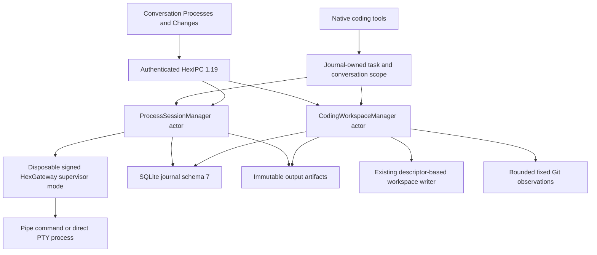
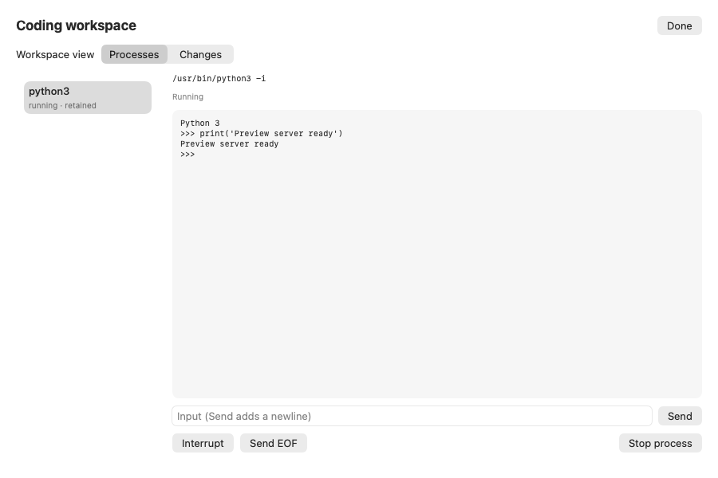
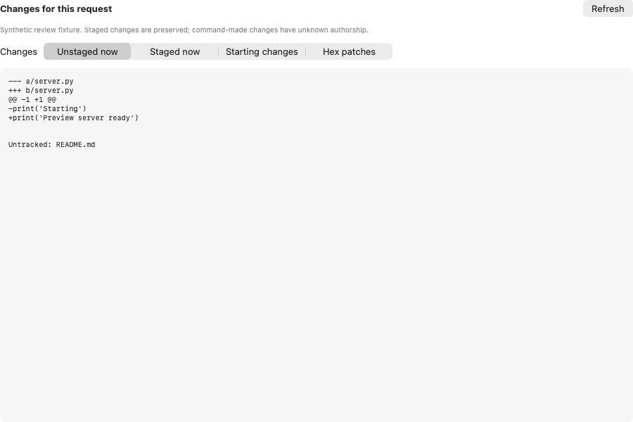

# Coding workflows implementation and verification

Implemented for ticket `435E5083-72FD-4F2C-B32F-F8A8F8DB6862`, **Finish real coding workflows with persistent terminals and reviewable changes**.

Feature branch: `codex/coding-workflow-architecture-20260909`.
Worktree: `/Users/horcrux/ActiveDev/Hex-worktrees/coding-workflow-architecture`.
Base: `94e3b20b0fb898eaefc5527bbee282def7e892c2` on local `dev`.

This is the implementation contract. The earlier [design record](coding-workflows-2026-09-09.md) explains the decisions and [primary-source research](coding-harness-research-2026-09-09.md); where names, limits or verification differ, this document describes the code delivered here. Implementation and local verification are complete; integration into `dev`, activation of the installed resident, and the live provider journey remain open. No remote push or merge is included.

## Behavior delivered

Hex can start an authorized build, script, server or direct REPL and immediately return a stable session ID. The resident owns the process independently of tool returns and the conversation window. Later tools and the conversation's Processes panel can inspect output, send acknowledged input, interrupt, resize a PTY, send EOF or stop the process. Every model operation resolves its task and conversation from the journal. Knowing another conversation's session ID grants no access.

The coding loop now supports a known compiler failure, a revision-checked edit, and the same command again after an actual recorded edit. A nonzero process exit is a completed execution result; output loss or unknown cleanup still requires attention. The native session start has its own repeat guard. Other effectful tools retain the existing task replay protection.

A retained server or REPL can also be started by a fresh authorized call after an explicit stop with supervisor-confirmed cleanup, without requiring a source edit. Retrying the original start identity returns its old receipt. A live or unresolved matching session still prevents a duplicate, and a completed one-shot command still requires a recorded edit. A known start-preflight conflict returns a recoverable failure stating that no process was dispatched; unknown spawn or IPC failures continue to stop the run as uncertain.

`workspace_apply_patch` adds an exact unified-diff operation. It preflights revisions and hunk contents and saves immutable before/after images before publishing any file. Each file publication uses the existing guarded workspace writer. A later failure retains completed files, stops the operation, and exposes a partial receipt with the remaining files unattempted. There is no blind rollback or replay. The existing write/replace tools also record change receipts and advance the edit generation when content actually changes.

The Changes panel shows staged changes, unstaged changes, the baseline before the task's first coding action, and typed Hex change receipts. Each receipt links to saved before/proposed-after text. Git observations preserve staged and unrelated work. Changes made by commands or outside Hex have unknown authorship; a Git diff alone does not attribute them to Hex. These features never automatically commit, reset, stash, push, or install dependencies.

## Ownership and data flow



The existing embedded `HexGateway` binary implements two early private modes: supervisor and terminal child. They run before provider, resident settings, Keychain or service initialization. There is no new executable target, public listener, LaunchAgent, singleton, mutable global, or Swift code between fork and exec. The supervisor uses `posix_spawn`; the fresh PTY child claims `/dev/tty` with `TIOCSCTTY`, sets the foreground group, closes its private configuration descriptor, and execs the target.

The supervisor is isolated from the owner's process group. It owns target descriptors, the process group and wait handle. It retains the exited leader as a waitable zombie while stopping the supported group, avoiding a signal sent to a reused PID. Pipe descriptors and private configuration endpoints are not inherited by unrelated children. Inputs and outgoing frames are bounded; lease/deadline checks continue during output activity.

The resident constructs one process manager and one coding manager, injects their Core protocols into the gateway service, and attaches the existing SQLite actor before task scheduling. It shuts down processes before closing the journal. A live process holds a workspace lease: another conversation cannot start coding work in that workspace until cleanup is confirmed or the user explicitly reconciles the unknown outcome. Work in the owning conversation remains possible for a build–edit–build loop.

## Tool and interface contract

| Interface | Behavior |
| --- | --- |
| `process_start` | Exact executable/argv, optional `pipe` or `pty`, task or retained lifetime, bounded deadline. Uses the existing executable/cwd identity authorization plus a full-call authorization receipt. |
| `process_list` | Conversation-scoped session history with pagination. |
| `process_read` | Byte-offset read with independent cursors. Seals output before publishing its durable cursor. UTF-8 or base64 is explicitly identified in tool results. |
| `process_input` | Input bytes, expected input sequence and a stable operation identity. Persists reservation before sending once. |
| `process_control` | Interrupt, EOF, resize or stop with the same receipt protocol. |
| `workspace_apply_patch` | Exact bounded unified diff with an expected revision for every existing changed/deleted file. |
| `workspace_changes` | Bounded Git previews and pages of typed change receipts. |
| `GatewayProcessSessionRequest` | Authenticated list/read/command/changes/patch-file requests; connection validity checked again after awaits. |

The model supplies neither process ownership nor replay authority. Native input operations include the originating task; cancellation closes admission and a final pre-dispatch check prevents a late operation from starting after that task closes. Human controls use the authenticated app connection. An input reply lost after acceptance can be checked with the same operation ID and exact payload. The UI retains that identity and draft rather than sending a replacement input automatically.

Process records retain scope, epoch, creator run/call, executable/argv, deadline, phase, revision, edit generation, input sequence, durable byte count, termination, cleanup and reconciliation evidence. Input records retain an HMAC digest and accepted byte count, not raw input. The HMAC key exists only for the resident epoch. After resident replacement, old input receipts cannot authorize retransmission. Input may still appear in process output if the child echoes it; users and models must not put secrets in command arguments.

SQLite schema 7 adds process sessions, operation receipts, output segments, task coding baselines and patch receipts through the existing migrator. Segment insertion and the session's durable byte cursor advance atomically. Older schema fixtures migrate; unsupported future schemas fail closed. App/helper protocol 1.19 rejects older peers at handshake, before using the new wire operation. This requires deploying the app and helper together. A schema-6 binary cannot open an upgraded journal; reverting a binary alone is not a database rollback.

## Lifecycle and recovery

| Event | Result |
| --- | --- |
| Tool result, turn boundary, task pause, UI closure | The resident continues owning the session. Session IDs and saved output remain stable. |
| Normal task completion | Task-lifetime sessions stop and require confirmed group cleanup. Explicit retained sessions may continue until stopped or their deadline. |
| Task cancellation | Admissions close immediately, including retained sessions created by that task; completion waits for cleanup evidence. |
| Output/storage failure or lost supervisor reply | Session becomes blocked with cleanup/output uncertainty. Further automatic execution is not inferred safe. |
| Resident control EOF | Supervisor terminates the supported group, drains bounded output, and escalates to SIGKILL if necessary. |
| Resident startup | Prior nonterminal sessions become interrupted. No PID reattachment, command restart or input replay. The journal keeps its durable output prefix and unknown cleanup state. |
| Explicit user reconciliation | Records an acknowledgement and observed file revisions; releases the corresponding conservative workspace lease. It never fabricates confirmed cleanup, authorship or a replayed operation. |

Lease renewals occur every 2 seconds; expiry is 15 awake seconds. Sleep does not consume the awake lease. Wake requires renewal within 5 awake seconds, bounded by the remaining lease. An expired lease cannot revive. Command deadlines count elapsed wall time including sleep. Ordinary stop uses TERM followed by KILL after 3 seconds. Output draining after leader exit is bounded to 1 second; unresolved capture or group state is reported honestly.

Supported cleanup covers the owned process group. Full job-control shells, daemons or children that detach into another session/group are outside this version's guarantee. A supervisor crash can leave cleanup unconfirmed; the resident does not signal a remembered numeric PID after ownership is lost. Simultaneous owner/supervisor death is not solved by this design.

## Explicit limits and differences from the proposal

| Resource | Implemented limit or behavior |
| --- | --- |
| Live processes | 4 per resident; 2 per conversation. |
| Runtime | Default 30 minutes; maximum 8 hours. No unlimited background daemon hosting. |
| Input | 16 KiB per operation. A partial pipe write becomes unknown and stops the group. |
| Output | Combined stdout/stderr, including pipe mode. No separate tagged stream projection in v1. |
| Output storage | 64 MiB and 2,048 segments per session; 512 MiB and 8,192 segments overall, plus the existing artifact/database quotas. |
| Sealing | 256 KiB, 30 seconds, or an explicit read. Frequent reads can reach the segment-count limit before the byte limit; exhaustion blocks/stops capture rather than growing without bound. |
| Output reads/UI | Maximum 64 KiB per request; UI retains a 64 KiB visible tail and can read saved output again. Plain text, not a VT terminal emulator. |
| Patch | 512 KiB patch input, 32 files, 256 hunks per file, 512 KiB resulting file; exact UTF-8 text only. |
| Patch dialect | `--- a/path`, `+++ b/path`, `@@`; `/dev/null` for create/delete. No fuzzy offsets, rename/mode/binary/quoted-path/timestamp headers or missing-final-newline patches. Use existing guarded write/replace for supported full-text alternatives. |
| Partial patch | Whole content/revision preflight, then per-file atomic publication. Filesystem races, missing parents, cancellation and storage failure can still stop later publication. Durable receipts identify partial progress. |
| Delete | The original inode is moved to a retained recovery tombstone. Same-volume transaction namespace has 64 slots; retained tombstones can exhaust it. No automatic deletion of recovery residue. |
| Git reads | Selected workspace must be the repository root. Fixed commands, 2 MiB per command, 512 untracked paths and 16 MiB aggregate untracked text inspection. Two passes reject observable changes during capture. |
| Git display | Status preview 8 KiB, each diff 32 KiB, first 30 untracked paths; truncation is explicit. Binary/linked/large/unreadable untracked content is recorded as unavailable. |
| Git state | Raw HEAD/status/diffs, not the proposal's richer typed conflict/submodule/rename model. Submodule content is excluded. An unborn HEAD is represented by the bounded Git observation. |
| Receipts | 100 per task, shown 10 per page; 32 KiB per saved-image preview. Full before/after artifacts remain subject to artifact retention. |
| Phases | `preparing`, `running`, `exited`, `interrupted`, `blocked`; cleanup and reconciliation are separate evidence. No standalone persisted `stopping` phase. |

Git reads disable optional index locks, pager, external diff, textconv, filesystem monitoring, hooks and configured clean/smudge/process filters. Tests install local marker-writing filter/fsmonitor commands and confirm they are not invoked. This is a bounded best-effort observation under concurrent filesystem changes, not a transactional Git snapshot or an attribution system.

## Verification evidence

Final verification: **1,360 package tests across 266 suites passed**, **2 hosted app tests passed**, and the Xcode Debug test build succeeded. The **10 coding integration tests also passed using the signed nested gateway** instead of the SwiftPM helper. Both nested and outer code signatures validate. Lint/layout and whitespace checks passed on the delivered changes. The integration tests exercise real subprocesses, a temporary SQLite journal, artifacts and guarded workspace files. The app tests use an injected client; screenshots are synthetic fixtures and do not demonstrate a provider session or installed resident.

- Real native workflow: compile invalid C with `/usr/bin/clang`, inspect the known exit-1 error, apply a revision-checked correction, repeat the identical compiler command, run the resulting executable, review its patch receipt, and verify an unrelated user draft keeps its revision.
- Pipe input is acknowledged once; duplicate operation identities return the existing receipt. Two readers observe the same bytes independently and another conversation is denied.
- A real PTY owns `/dev/tty` and the foreground process group; resize/stop work.
- Patch conflict preflight leaves earlier files untouched; deletion retains recovery data. Partial publication and explicit reconciliation preserve evidence and do not replay changes.
- Legacy write/replace edits advance the generation; late cancelled-task starts are refused.
- Restart preserves the sealed output prefix, records interrupted ownership, and never upgrades acknowledgement to confirmed cleanup.
- Git review preserves staged, dirty and untracked work without running configured filter/fsmonitor helpers.
- A lost input reply in the app model retains exactly the same operation identity and payload for receipt lookup.
- Signed nested helper probes pass pipe input/EOF, PTY ownership/input/resize, repeated local HTTP server access, explicit stop, owner EOF cleanup, and a 1,000,000-byte output drain with known exit 1. These are direct helper probes, not launchd-backed XPC or live-provider tests.

Commands used from the feature worktree:

```sh
./script/lint.sh
HEX_PROCESS_SUPERVISOR=/tmp/hex-coding-package/debug/HexGateway \
  DEVELOPER_DIR=/Applications/Xcode.app/Contents/Developer \
  xcrun swift test --package-path Packages/HexKit \
  --scratch-path /tmp/hex-coding-package -j 2 --no-parallel

TEST_RUNNER_HEX_CODING_UI_CAPTURE_DIRECTORY=/tmp/hex-coding-ui-captures \
  DEVELOPER_DIR=/Applications/Xcode.app/Contents/Developer \
  xcodebuild -project Hex.xcodeproj -scheme Hex -configuration Debug \
  -destination 'platform=macOS' -derivedDataPath /tmp/hex-coding-derived \
  -clonedSourcePackagesDirPath /tmp/hex-context-derived/SourcePackages \
  -jobs 2 CC=/tmp/hex-context-clang CPLUSPLUS=/tmp/hex-context-clang \
  -parallel-testing-enabled NO -only-testing:HexTests/AgentCodingWorkspaceTests test

codesign --verify --strict --verbose=2 \
  /tmp/hex-coding-derived/Build/Products/Debug/Hex.app/Contents/Resources/HexGateway.app
codesign --verify --deep --strict --verbose=2 \
  /tmp/hex-coding-derived/Build/Products/Debug/Hex.app
HEX_PROCESS_SUPERVISOR=/tmp/hex-coding-derived/Build/Products/Debug/Hex.app/Contents/Resources/HexGateway.app/Contents/MacOS/HexGateway \
  DEVELOPER_DIR=/Applications/Xcode.app/Contents/Developer \
  xcrun swift test --package-path Packages/HexKit \
  --scratch-path /tmp/hex-coding-package -j 2 --skip-build --no-parallel \
  --filter CodingWorkflowTests
python3 docs/architecture/evidence/coding-workflows-2026-09-09/signed-helper-probe.py \
  /tmp/hex-coding-derived/Build/Products/Debug/Hex.app/Contents/Resources/HexGateway.app/Contents/MacOS/HexGateway
git diff --check
```

The local compiler wrapper delegates to Xcode's clang and removes a redundant verbose compiler-probe line only for the macro probe that otherwise hangs on this machine. It is not a repository change. SwiftPM uses the Xcode toolchain explicitly. The Xcode test build stages and signs the nested gateway through the existing project build phase. It does not install/register a service.

Local logs: `/tmp/hex-coding-full-complete-tests.log`, `/tmp/hex-coding-xcode-complete.log`, `/tmp/hex-coding-signed-workflow-tests.log`, `/tmp/hex-coding-lint-verified.log`. The signed helper [probe](evidence/coding-workflows-2026-09-09/signed-helper-probe.py) and [result summary](evidence/coding-workflows-2026-09-09/signed-helper-results.txt) are retained with this handoff. The final Xcode result bundle is `/tmp/hex-coding-derived/Logs/Test/Test-Hex-2026.09.09_13-05-40--0500.xcresult`. The only source adjustment after that build was moving a comment onto its own line for lint.

An earlier default parallel full package run crashed with SIGBUS and no usable crash report. Serial execution then exposed a shared temporary transaction-namespace fixture issue. The affected test fixtures now allocate isolated namespaces; only this task's identified crashed-test directories were removed. Final reported package evidence uses explicit serial execution, not an unexplained claim that the default parallel crash was fixed.

## Remaining activation and qualification gates

1. Review and integrate the feature commit into `dev`; deploy app/helper together with protocol 1.19 and schema 7 awareness.
2. Exercise the signed, installed launchd-backed resident through the actual app: build–fix–rebuild, retained session across UI quit/reopen, follow-up task access, and review. A direct helper and synthetic UI test do not prove this path.
3. Exercise a configured live provider selecting these native tools and using the revised loop. No provider credential, OAuth flow, model download or consequential live task was used here.
4. Verify physical sleep/wake, resident SIGKILL and supervisor crash through that installed path. Lease-clock tests and owner-EOF helper probes establish narrower evidence.
5. Keep detached process groups, terminal emulation, recovery tombstone reclamation and richer Git state outside the supported claim until separately implemented and tested.

The ticket remains In Progress until the installed journey is demonstrated. No privacy grants, service registration, production settings, source remotes or existing app installation were changed.

## UI fixtures reviewed

Rendered at 900 × 600 in the hosted app test. These are fixtures, not screenshots of a live coding session. Review found and corrected centered short terminal/diff text; final content is anchored at the top left.






## Exact changed files

The feature commit contains these 102 paths. No steward-owned project, package manifest, configuration, signing, scheme or script files changed. Main and the `dev` integration worktree were verified clean at their existing commits.

```text
Hex/Models/Agent/AgentCodingWorkspaceModel.swift
Hex/Services/Agent/HexLiveAgentClient.swift
Hex/Views/Agent/AgentChangesReviewView.swift
Hex/Views/Agent/AgentChatWorkspaceView.swift
Hex/Views/Agent/AgentCodingPanelView.swift
Hex/Views/Agent/AgentPatchPreviewView.swift
Hex/Views/Agent/AgentProcessActivityView.swift
HexTests/Agent/AgentCodingWorkspaceTests.swift
Packages/HexKit/Sources/HexCapabilities/Coding/CodingLegacyWriteTool.swift
Packages/HexKit/Sources/HexCapabilities/Coding/CodingWorkspaceManager+LegacyWrites.swift
Packages/HexKit/Sources/HexCapabilities/Coding/CodingWorkspaceManager+Preview.swift
Packages/HexKit/Sources/HexCapabilities/Coding/CodingWorkspaceManager+Reconciliation.swift
Packages/HexKit/Sources/HexCapabilities/Coding/CodingWorkspaceManager.swift
Packages/HexKit/Sources/HexCapabilities/Coding/GitWorkspaceReader.swift
Packages/HexKit/Sources/HexCapabilities/Coding/UnifiedPatch.swift
Packages/HexKit/Sources/HexCapabilities/Coding/UnifiedPatchFile.swift
Packages/HexKit/Sources/HexCapabilities/Coding/WorkspaceChangesTool.swift
Packages/HexKit/Sources/HexCapabilities/Coding/WorkspacePatchError.swift
Packages/HexKit/Sources/HexCapabilities/Coding/WorkspacePatchTool.swift
Packages/HexKit/Sources/HexCapabilities/Process/ProcessExecutionIdentity.swift
Packages/HexKit/Sources/HexCapabilities/Process/ProcessToolResult.swift
Packages/HexKit/Sources/HexCapabilities/ProcessSessions/LiveProcessSession.swift
Packages/HexKit/Sources/HexCapabilities/ProcessSessions/ProcessOwnerLease.swift
Packages/HexKit/Sources/HexCapabilities/ProcessSessions/ProcessSessionErrorBridge.swift
Packages/HexKit/Sources/HexCapabilities/ProcessSessions/ProcessSessionManager+Controls.swift
Packages/HexKit/Sources/HexCapabilities/ProcessSessions/ProcessSessionManager.swift
Packages/HexKit/Sources/HexCapabilities/ProcessSessions/ProcessSessionSupervisor+Loop.swift
Packages/HexKit/Sources/HexCapabilities/ProcessSessions/ProcessSessionSupervisor+Spawn.swift
Packages/HexKit/Sources/HexCapabilities/ProcessSessions/ProcessSessionSupervisor+TerminalChild.swift
Packages/HexKit/Sources/HexCapabilities/ProcessSessions/ProcessSessionSupervisor.swift
Packages/HexKit/Sources/HexCapabilities/ProcessSessions/ProcessSessionTool.swift
Packages/HexKit/Sources/HexCapabilities/ProcessSessions/ProcessStartTool.swift
Packages/HexKit/Sources/HexCapabilities/ProcessSessions/ProcessSupervisorChild.swift
Packages/HexKit/Sources/HexCapabilities/ProcessSessions/ProcessSupervisorConnection.swift
Packages/HexKit/Sources/HexCapabilities/ProcessSessions/ProcessSupervisorMessage.swift
Packages/HexKit/Sources/HexCapabilities/ProcessSessions/ProcessSupervisorRequest.swift
Packages/HexKit/Sources/HexCapabilities/Tools/PersonalAgentToolExecutor.swift
Packages/HexKit/Sources/HexCapabilities/Workspace/WorkspaceDeletionResult.swift
Packages/HexKit/Sources/HexCapabilities/Workspace/WorkspaceFileSystem+Delete.swift
Packages/HexKit/Sources/HexCapabilities/Workspace/WorkspaceFileSystem+Write.swift
Packages/HexKit/Sources/HexCore/Coding/CodingWorkspaceControlling.swift
Packages/HexKit/Sources/HexCore/Coding/CodingWorkspaceStorage.swift
Packages/HexKit/Sources/HexCore/Coding/GitWorkspaceSnapshot+Preview.swift
Packages/HexKit/Sources/HexCore/Coding/GitWorkspaceSnapshot.swift
Packages/HexKit/Sources/HexCore/Coding/WorkspaceChangesReview.swift
Packages/HexKit/Sources/HexCore/Coding/WorkspaceFileChangePreview.swift
Packages/HexKit/Sources/HexCore/Coding/WorkspacePatchReceipt.swift
Packages/HexKit/Sources/HexCore/ProcessSessions/ProcessOutputSegment.swift
Packages/HexKit/Sources/HexCore/ProcessSessions/ProcessSessionCommand.swift
Packages/HexKit/Sources/HexCore/ProcessSessions/ProcessSessionControlling.swift
Packages/HexKit/Sources/HexCore/ProcessSessions/ProcessSessionError.swift
Packages/HexKit/Sources/HexCore/ProcessSessions/ProcessSessionOperation.swift
Packages/HexKit/Sources/HexCore/ProcessSessions/ProcessSessionPage.swift
Packages/HexKit/Sources/HexCore/ProcessSessions/ProcessSessionRecord.swift
Packages/HexKit/Sources/HexCore/ProcessSessions/ProcessSessionScope.swift
Packages/HexKit/Sources/HexCore/ProcessSessions/ProcessSessionStorage.swift
Packages/HexKit/Sources/HexCore/Tools/ToolExecutionOutcome.swift
Packages/HexKit/Sources/HexCore/Tools/ToolResult.swift
Packages/HexKit/Sources/HexGatewayCommand/HexGatewayCommand.swift
Packages/HexKit/Sources/HexGatewayKit/Composition/HexGatewayComposition.swift
Packages/HexKit/Sources/HexGatewayKit/Composition/HexGatewayCompositionConfiguration.swift
Packages/HexKit/Sources/HexGatewayKit/Composition/HexTaskGuardedToolExecutor.swift
Packages/HexKit/Sources/HexGatewayKit/Resident/HexGatewayResidentHost.swift
Packages/HexKit/Sources/HexGatewayKit/Resident/HexProcessSupervisorEntry.swift
Packages/HexKit/Sources/HexGatewayKit/SelfKnowledge/HexSelfOperatingManual.swift
Packages/HexKit/Sources/HexIPC/Client/HexGatewayClient+ProcessSessions.swift
Packages/HexKit/Sources/HexIPC/Contracts/GatewayProtocolVersion.swift
Packages/HexKit/Sources/HexIPC/Processes/GatewayProcessSessionRequest.swift
Packages/HexKit/Sources/HexIPC/Processes/HexGatewayProcessSessionClient.swift
Packages/HexKit/Sources/HexIPC/Processes/HexGatewayProcessSessionTransport.swift
Packages/HexKit/Sources/HexIPC/Service/HexGatewayService+ProcessSessions.swift
Packages/HexKit/Sources/HexIPC/Service/HexGatewayService+TaskRecovery.swift
Packages/HexKit/Sources/HexIPC/Service/HexGatewayService+Tasks.swift
Packages/HexKit/Sources/HexIPC/Service/HexGatewayService.swift
Packages/HexKit/Sources/HexIPC/Tasks/GatewayTaskCheckpoint.swift
Packages/HexKit/Sources/HexIPC/Transport/InProcessHexGatewayTransport.swift
Packages/HexKit/Sources/HexIPC/Wire/GatewayXPCOperation.swift
Packages/HexKit/Sources/HexIPC/XPC/HexGatewayXPCService.swift
Packages/HexKit/Sources/HexIPC/XPC/XPCGatewayTransport.swift
Packages/HexKit/Sources/HexPersistence/SQLite/Journal/SQLiteAgentEventJournal+Coding.swift
Packages/HexKit/Sources/HexPersistence/SQLite/Journal/SQLiteAgentEventJournal+ProcessSessions.swift
Packages/HexKit/Sources/HexPersistence/SQLite/Migrations/SQLiteJournalMigrator+ProcessSessions.swift
Packages/HexKit/Sources/HexPersistence/SQLite/Migrations/SQLiteJournalMigrator+Validation.swift
Packages/HexKit/Sources/HexPersistence/SQLite/Migrations/SQLiteJournalMigrator.swift
Packages/HexKit/Sources/HexRuntime/Agent/AgentRuntime+Artifacts.swift
Packages/HexKit/Tests/HexCapabilitiesTests/Process/ProcessOwnerLeaseTests.swift
Packages/HexKit/Tests/HexCapabilitiesTests/Workspace/WorkspaceFileSystemTransactionRegressionTests.swift
Packages/HexKit/Tests/HexGatewayTests/Coding/CodingWorkflowTests.swift
Packages/HexKit/Tests/HexIPCTests/Tasks/GatewayTaskExecutionOutcomeTests.swift
Packages/HexKit/Tests/HexIPCTests/Transport/XPCGatewayTransportTests.swift
Packages/HexKit/Tests/HexIPCTests/Wire/GatewayImplementedVersionTests.swift
Packages/HexKit/Tests/HexPersistenceTests/SQLite/Journal/SQLiteTaskStorageTests.swift
Packages/HexKit/Tests/HexPersistenceTests/SQLite/Migrations/SQLiteConversationTaskMigrationTests.swift
Packages/HexKit/Tests/HexPersistenceTests/SQLite/Migrations/SQLiteJournalMigrationTests.swift
docs/architecture/coding-harness-research-2026-09-09.md
docs/architecture/coding-workflows-2026-09-09.md
docs/architecture/coding-workflows-implementation-2026-09-09.md
docs/architecture/evidence/coding-workflows-2026-09-09/coding-changes-fixture.png
docs/architecture/evidence/coding-workflows-2026-09-09/coding-patch-fixture.png
docs/architecture/evidence/coding-workflows-2026-09-09/coding-processes-fixture.png
docs/architecture/evidence/coding-workflows-2026-09-09/signed-helper-probe.py
docs/architecture/evidence/coding-workflows-2026-09-09/signed-helper-results.txt
```
