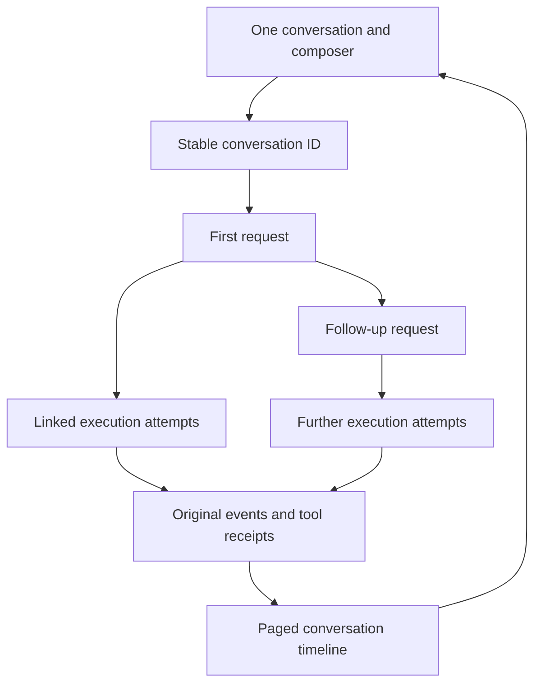

# Unified conversations

The app presents one conversation and one composer. A conversation is the durable parent of its
messages and requests. Tasks and runs remain separate execution records so a window can close,
work can pause, and an interrupted attempt can recover without creating a second chat.

## Ownership

`HexGatewayService` owns admission, queue order, context continuation, control and recovery.
`SQLiteAgentEventJournal` remains the sole database actor. `AgentChatWorkspaceModel` holds window
selection, bounded display pages and per-conversation drafts; it cannot replace the resident's
execution context. The former Tasks/Saved conversations navigation split is removed from the live
app. Preview and low-level run clients retain the legacy workspace adapter.

The existing conversation document is the catalog entry. Schema 6 adds `conversation_tasks` with
the immutable parent and predecessor relationship, and `conversation_timeline` with stable message
identities. Admission commits the request, parent link and user message together. Original journal
events and the timeline projection also share a transaction. Initial context messages are excluded
from the live projection; generated answers and tool records are included. Replayed messages are
deduplicated by identity.

## Messages and work

After completion, Send admits a new request in the same conversation. The admission includes only
the new user message and its expected predecessor. A conflicting predecessor rejects admission and
retains the draft. At dispatch, the resident reads the predecessor's completed checkpoint, including
its answer, tool results, compaction and artifacts. A cancelled request that never started is skipped
when locating that context. An in-flight cancelled request retains its verified checkpoint; uncertain
outcomes require reconciliation first.

While work is active, Send saves steering to that work and stops at the next safe boundary. When
paused, steering stays saved until Resume. Send next admits a separate follow-up that waits for
the preceding work to finish. The earliest unfinished request is queried independently from the
recent request page, so a long queue cannot move the pause, cancel or steering target accidentally.

Unconfirmed delivery retains the exact conversation, request and control operation identities.
Retrying an uncertain reply cannot silently create another request. Composer settings and navigation
are locked while delivery is unconfirmed. A definitive revision conflict retains the editable draft
for explicit resubmission. Per-conversation drafts do not spill into a different selected chat.

## Existing data and recovery

Schema 5 standalone tasks have no recorded original chat parent. Migration preserves each as one
conversation with its task ID; it does not guess a relationship from copied text. It backfills linked
attempt messages and receipts without altering task payloads or journal events. Existing conversation
documents and their original display/message rows remain intact. Their next ordinary message seeds
the first linked task from the validated working context and artifacts.

An older pending UI checkpoint is adopted from the resident's own stored document and verified
against its original journal. It becomes a linked task using the same run identity. Recovery first
reconciles saved evidence: completed work becomes completed, interrupted known work becomes paused,
and uncertain work becomes blocked. Adoption never automatically reissues the old request. The
original document remains unchanged. Missing or mismatched evidence keeps history visible with an
error. Initial archive import must succeed before the composer permits new admission; reconnect
retries preparation after transport or protocol upgrades.

## Bounds and controls

Conversation lists, timeline pages, requests and attempts are paged. These are working-memory and
transport bounds, not history deletion. Collapsed tool rows keep normal chat readable; Execution
history exposes original attempts and receipt pages on demand. Archive and rename use the existing
revisioned document API. An active conversation cannot be archived in the UI. Linked task ownership
prevents deleting a conversation out from under durable execution.

IPC 1.18 is required on both sides because the live UI depends on conversation-owned execution.
SQLite remains a single local database; this change adds no server, alternate store or mutable
service singleton. The existing limits on remote effect guarantees still apply, as described in
[Durable tasks](durable-tasks.md).
